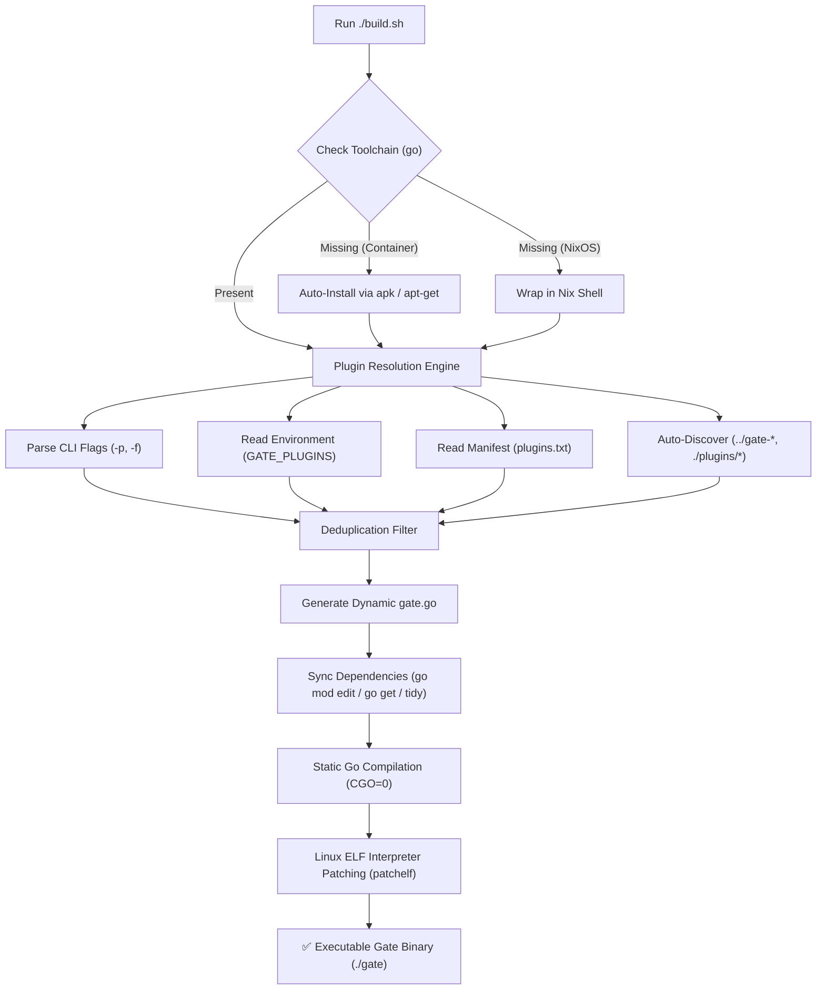

# 🔨 Gate Proxy Extension Builder (`build.sh`)

[](https://opensource.org/licenses/Apache-2.0)
[](https://www.gnu.org/software/bash/)
[](https://go.dev)
[](https://pelican.dev)

A zero-configuration, production-ready build engine designed to compile the [Minekube Gate](https://github.com/minekube/gate) Minecraft proxy with any combination of **local directories** and **remote Git extensions** into a single static, highly-optimized binary.

---

## 🌟 Key Capabilities

- 🔍 **Universal Auto-Discovery**: Automatically detects local plugins in adjacent directories (`../gate-*`) and subdirectories (`./plugins/*/`).
- 🌐 **Remote Git & Module Fetching**: Bundles GitHub/GitLab repositories and Go modules on the fly without needing to clone them locally.
- 📄 **Manifest Driven (`plugins.txt`)**: Manage your proxy's plugin ecosystem from a simple, human-readable text file.
- 🛡️ **Intelligent Deduplication**: Automatically prevents duplicate imports and module collisions.
- 🦅 **Pelican & Docker Native**: Seamlessly integrates into Pelican / Pterodactyl panels, Dockerfiles, and CI/CD pipelines.
- ⚡ **Pure Static Binaries**: Compiles with `CGO_ENABLED=0` and `-ldflags="-s -w"` for maximum portability across Alpine, Debian, Ubuntu, and RedHat.
- 🌍 **Cross-Compilation**: Build for Linux ARM64, Linux AMD64, macOS, or Windows with a single flag (`--target`).

---

## 🚀 Quick Start

### 1. Zero-Config Build
If you have local plugin folders (`../gate-*` or `./plugins/*`) or a `plugins.txt` manifest:
```bash
./build.sh
```

### 2. Build from Plugin Manifest (`plugins.txt`)
Create or edit `plugins.txt` in your project folder:
```text
# Local Development Extensions
../gate-simplewhitelist
../gate-hybridforwarding
../gate-bettertab
../gate-smartlimbo
../gate-discord4gate

# Remote Git Modules
# github.com/user/another-plugin@v1.0.0
# https://github.com/someone/gate-plugin.git
```
Then simply run:
```bash
./build.sh
```

### 3. Build via Command Line Flags
```bash
./build.sh -p "../gate-discord4gate, https://github.com/andreisugu/gate-bettertab.git"
```

---

## 🧩 Supported Plugin Input Formats

`build.sh` automatically normalizes, resolves, and registers plugins supplied in any of the following formats:

| Format | Example | Behavior |
| :--- | :--- | :--- |
| **Relative Path** | `../gate-bettertab` | Auto-detects module from local `go.mod` and adds local `replace` directive. |
| **Subdirectory** | `./plugins/my-custom-plugin` | Bundles local folder directly into the proxy entrypoint. |
| **Go Module Path** | `github.com/andreisugu/gate-discord4gate` | Fetches latest release via `go get` directly from GitHub. |
| **HTTPS Git URL** | `https://github.com/andreisugu/gate-hybridforwarding.git` | Strips `https://` and `.git`, resolving the module path automatically. |
| **SSH Git URL** | `git@github.com:andreisugu/gate-smartlimbo.git` | Converts SSH git path to Go module format. |
| **Pinned Version** | `github.com/user/plugin@v1.2.0` | Downloads and pins the exact tag or commit hash specified. |
| **Pinned Branch** | `https://github.com/user/plugin@main` | Fetches the latest commit from the target branch. |

---

## 📖 Command-Line Options

```text
Usage: ./build.sh [OPTIONS]

OPTIONS:
    -p, --plugins <list>     Comma or space-separated list of plugins.
                             Supports local paths (e.g. '../gate-discord4gate', './plugins/myplugin')
                             and remote Go modules/Git URLs (e.g. 'github.com/user/myplugin', 'https://github.com/...').
    -f, --file <path>        Path to a text file containing plugin list (default: 'plugins.txt' if present).
    -o, --output <path>      Output binary name or path (default: './gate' or '$SERVER_BINARY').
    -v, --version <tag>      Gate upstream version or tag (default: 'latest').
    -t, --target <os/arch>   Target platform (e.g. 'linux/amd64', 'linux/arm64', 'windows/amd64').
    -d, --debug              Enable debug build (preserves symbol tables and line numbers).
    -c, --clean              Clean build artifacts, temporary files, and go cache.
    --no-patch               Skip ELF interpreter patching on Linux.
    --dry-run                Generate 'gate.go' and 'go.mod' without compiling.
    -h, --help               Show help screen.
```

---

## 🌐 Environment Variables

All settings can be configured via environment variables for automation, container startup scripts, and panel integration:

| Variable | Description | Default |
| :--- | :--- | :--- |
| `GATE_PLUGINS` | Comma/space/newline separated list of plugins | `""` |
| `PLUGIN_FILE` | Path to custom plugins manifest text file | `plugins.txt` |
| `SERVER_BINARY` | Target output binary (matches Pelican egg standard) | `gate` |
| `OUTPUT_BINARY` | Alternative target output binary path | `gate` |
| `GATE_VERSION` | Upstream Gate version to pin (e.g. `v0.71.3` or `latest`) | `latest` |
| `TARGET_OS` | Target operating system (`linux`, `darwin`, `windows`) | Host OS |
| `TARGET_ARCH` | Target CPU architecture (`amd64`, `arm64`, `386`) | Host Arch |
| `GOPROXY` | Go module proxy URL | `https://proxy.golang.org,direct` |

---

## 🦅 Pelican & Pterodactyl Panel Integration

`build.sh` is built from the ground up to support containerized game server panels:

1. **Auto-Toolchain Provisioning**: If `go` or `git` is missing when run inside a Pelican installation container (Alpine or Debian), `build.sh` automatically installs them via `apk` or `apt-get`.
2. **Egg Variable Mapping**: Directly honors Pelican's `{{SERVER_BINARY}}` and `{{GATE_PLUGINS}}` environment variables.
3. **Web Panel Management**: Server owners can simply open Pelican's Web File Manager, edit `plugins.txt`, and restart or reinstall their server to recompile with new extensions.

### Example Pelican Egg Startup / Install Command
```bash
SERVER_BINARY="gate" GATE_PLUGINS="github.com/andreisugu/gate-simplewhitelist, github.com/andreisugu/gate-bettertab" ./build.sh
```

---

## 🎯 Cross-Compilation Examples

You can cross-compile static binaries for any architecture without setting up complex toolchains:

### Linux ARM64 (Raspberry Pi 4/5, Oracle Cloud Ampere, AWS Graviton)
```bash
./build.sh --target linux/arm64 -o gate-arm64
```

### Apple Silicon macOS (M1/M2/M3/M4)
```bash
./build.sh --target darwin/arm64 -o gate-darwin-arm64
```

### Windows x86_64
```bash
./build.sh --target windows/amd64 -o gate.exe
```

---

## 🔄 How the Build Workflow Operates Internally



---

## 🐳 Dockerfile Integration

To build a minimal, production-grade Docker image using `build.sh`:

```dockerfile
# Build Stage
FROM golang:1.24-alpine AS builder
WORKDIR /src
RUN apk add --no-cache bash git ca-certificates
COPY . .
RUN chmod +x ./build.sh && ./build.sh

# Production Image (Zero Overhead)
FROM alpine:latest
WORKDIR /app
COPY --from=builder /src/gate /app/gate
COPY --from=builder /src/config /app/config/
EXPOSE 25565
CMD ["./gate"]
```

---

## 🛠️ Troubleshooting

### 1. `go: command not found`
If running on a barebones Linux machine, install Go from [go.dev/dl](https://go.dev/dl/). If running in NixOS, `build.sh` automatically wraps itself using `nix shell`.

### 2. `Private Repository / Authentication Errors`
For private GitHub repositories, ensure your machine has SSH keys configured or configure Go's private module proxy:
```bash
export GOPRIVATE="github.com/my-private-org/*"
```

### 3. Cleaning the Build Cache
If you encounter corrupted dependency caches or want a completely fresh build:
```bash
./build.sh --clean
```

---

## 📄 License

This build engine is licensed under the [Apache License, Version 2.0](LICENSE).
EOF
